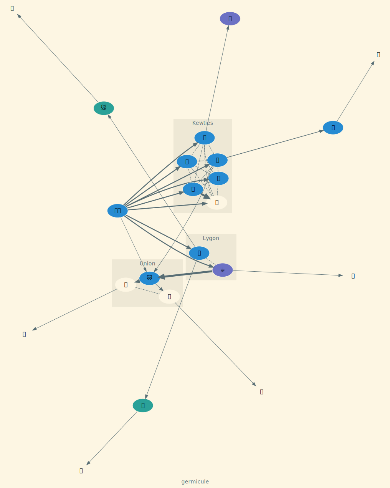

# Germicule

Visualize your contacts and their COVID risk factors

Line thickness represents ammount of contact

Node size represents covid risk factor.

Example data:

```json
{
    "version": 0.1,
    "name": "👨‍🎤",
    "risk": 2 ,
    "germicule": [
        {
            "name": "🐺",
            "risk": 2,
            "contact": 1,
            "description": "Housemate",
            "cluster": "Lygon",
            "germicule": [
                {
                    "name": "🐭",
                    "risk": 1,
                    "contact": null,
                    "description": null,
                    "germicule": [
                        null
                    ]
                },
                {
                    "name": "🐶",
                    "risk": 1,
                    "contact": null,
                    "description": null,
                    "germicule": [
                        null
                    ]
                }
            ]
        },
    ...
    ]
}
```

produces:



## Requirements

- Install graphviz http://www.graphviz.org/Download.php
- Install graphviz python wrapper: https://pypi.python.org/pypi/graphviz

## Usage

```txt
usage: germicule.py [-h] --in-file IN_FILE [--name NAME] [--engine ENGINE] [--format FORMAT] [--view]

Visualize your contacts and their COVID risk factors

optional arguments:
  -h, --help            show this help message and exit
  --in-file IN_FILE     The JSONC input file
  --name NAME           The graph name
  --engine ENGINE, -K ENGINE
                        The graphviz engine to use
  --format FORMAT, -T FORMAT
                        The graphviz format to use
  --view                whether to view the graph
```
